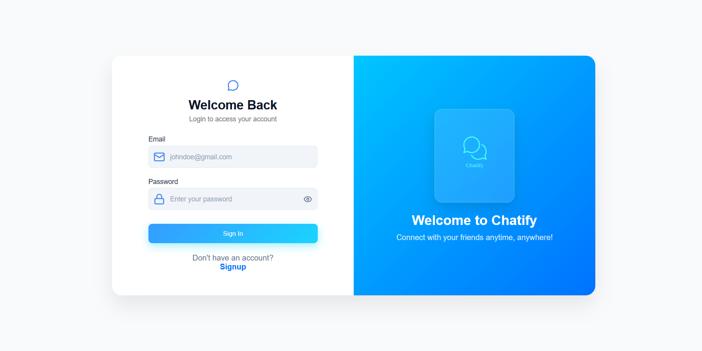
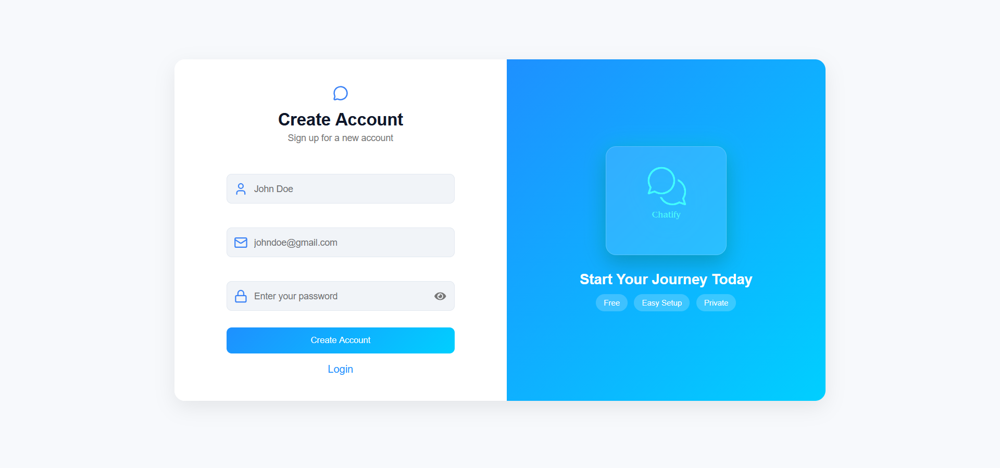
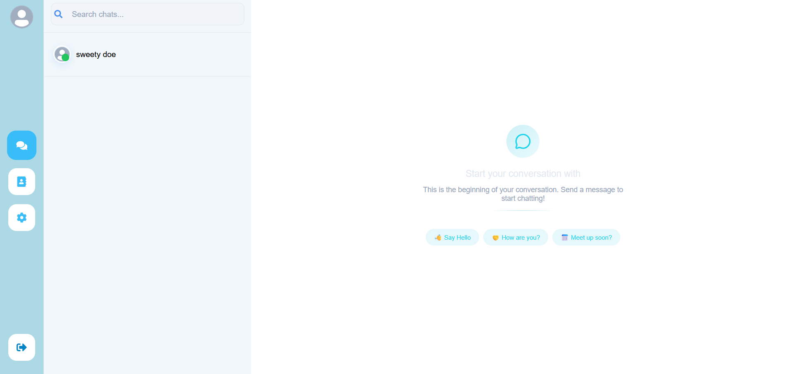
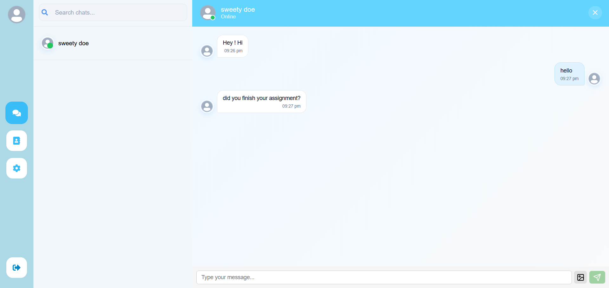

<div align="center"

# 💬 Chatify

**A modern, real-time chat application built for seamless communication.**

[](https://reactjs.org/)
[](https://nodejs.org/)
[](https://mongodb.com/)
[](https://socket.io/)
[](LICENSE)

[Features](#-features) · [Tech Stack](#-tech-stack) · [Getting Started](#-getting-started) · [Folder Structure](#-folder-structure) · [Roadmap](#-roadmap) · [Contributing](#-contributing)

</div>

---

## 📖 Overview

Chatify is a full-stack, real-time messaging application designed to connect people instantly and intuitively. With a clean, responsive interface and dark/light mode support, Chatify delivers a smooth communication experience across all devices — from desktop to mobile.

---
## Ui
**Login Page**  
  

**Sigup page**
  

**Start conversation page*  
  

**Chat Page**  
  


## ✨ Features

| Feature | Description |
|---|---|
| ⚡ **Real-Time Messaging** | Send and receive messages instantly using Socket.IO |
| 🗂️ **Persistent Sidebar** | Quickly navigate between chats and contacts |
| 👤 **User Profiles** | Personalize your account with a profile picture |
| 🟢 **Active Chat Indicator** | See which chats are currently active at a glance |
| 🔍 **Search** | Find contacts or past messages in seconds |
| ⚙️ **Settings Panel** | Change name and password |
| 📱 **Responsive Design** | Fully optimized for desktop, tablet, and mobile |
| 🔐 **Secure Authentication** | Safe login and signup with JWT / Firebase Auth |

---

## 🛠️ Tech Stack

**Frontend**
- [React.js](https://reactjs.org/) — UI library
- [React Router DOM](https://reactrouter.com/) — Client-side routing
- [React Icons](https://react-icons.github.io/react-icons/) — Icon library (FontAwesome)
- CSS3 / HTML5

**Backend**
- [Node.js](https://nodejs.org/) + [Express.js](https://expressjs.com/) — REST API server
- [Socket.IO](https://socket.io/) — Real-time bidirectional communication

**Database & Auth**
- [MongoDB](https://mongodb.com/) / Firebase — Data persistence
- JWT / Firebase Auth — Authentication & authorization

**Design**
- [Figma](https://figma.com/) — UI/UX prototyping

---

## 🚀 Getting Started

### Prerequisites

Make sure you have the following installed:
- [Node.js](https://nodejs.org/) (v16 or higher)
- [npm](https://npmjs.com/) or [yarn](https://yarnpkg.com/)

### Installation

1. **Clone the repository**
   ```bash
   git clone https://github.com/yourusername/chatify.git
   cd chatify
   ```

2. **Install dependencies**
   ```bash
   npm install
   ```

3. **Configure environment variables**

   Create a `.env` file in the root directory:
   ```env
   REACT_APP_API_URL=http://localhost:5000
   REACT_APP_SOCKET_URL=http://localhost:5000
   # Add your Firebase / MongoDB / JWT config here
   ```

4. **Start the development server**
   ```bash
   npm start
   ```

5. **Open in your browser**
   ```
   http://localhost:3000
   ```

## 📱 Usage

1. **Sign up or log in** to access your account securely.
2. **Browse contacts** or use the search bar to find friends.
3. **Click a contact** to open a real-time conversation.
4. **Customize your profile** — update your picture.

---

## 🗺️ Roadmap

- [ ] Group chats and media sharing
- [ ] Message reactions and emoji support
- [ ] Typing indicators and read receipts
- [ ] Push notifications
- [ ] Improved mobile app experience

---

## 🤝 Contributing

Contributions are always welcome!

1. Fork the repository
2. Create a new branch: `git checkout -b feature/your-feature-name`
3. Commit your changes: `git commit -m 'Add some feature'`
4. Push to the branch: `git push origin feature/your-feature-name`
5. Open a pull request

Please make sure to update tests as appropriate and follow the existing code style.

---

<div align="center">

⭐ Star this repo if you find it helpful!

</div>